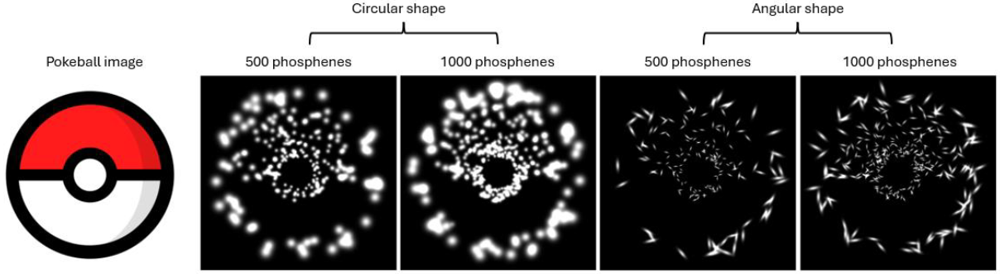

# Phosphene Simulation & Human Perception Analysis
---

## Overview
This project investigates how algorithmic design choices in phosphene-based visual
simulation influence human interpretability of visual cortical prosthetic outputs.
The work combines computer vision, simulation, and human-subject experimentation to
study perception under low-resolution visual representations.

---

## Motivation
Visual cortical prostheses operate under severe spatial and information constraints.
As a result, how visual information is encoded—through preprocessing, phosphene
configuration, and simulation parameters—has a significant impact on downstream
perception.

This project explores these design choices using controlled simulation and human
evaluation to better understand qualitative and quantitative perceptual effects.

---

## System Overview
The high-level workflow consists of:

1. Image and video preprocessing using computer vision techniques  
2. Phosphene simulation using a biologically inspired cortical model  
3. Stimulus generation under controlled parameter variations  
4. Human perception experiments conducted via an online survey platform  
5. Quantitative analysis of perceptual performance and confidence  
---

## Human Perception Experiment
A human-subject experiment was conducted to evaluate perceptual interpretability under
different simulation and preprocessing conditions.

- Stimuli were generated offline using the simulation pipeline
- Participants viewed phosphene-rendered visual stimuli
- Responses included recognition accuracy and confidence ratings
- Analysis was performed using Signal Detection Theory (d′)

To protect participant privacy and comply with ethical guidelines, raw data and survey
implementations are not included. A summary of the experimental design is provided in
`docs/human_study_design.md`.

---

## Dependencies and Prior Work
This project builds upon the open-source phosphene simulation framework **Dynaphos**
(van der Grinten et al., 2024), which provides a biologically inspired model of cortical
phosphene generation.

The underlying simulator is used as a baseline component. All experimental design,
preprocessing strategies, analysis, and interpretation were developed independently
as part of this work.

---

## Tech Stack
Python · OpenCV · PyTorch · MATLAB · NumPy · SciPy · Matplotlib
